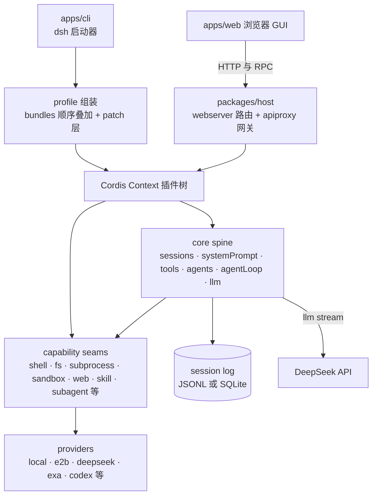
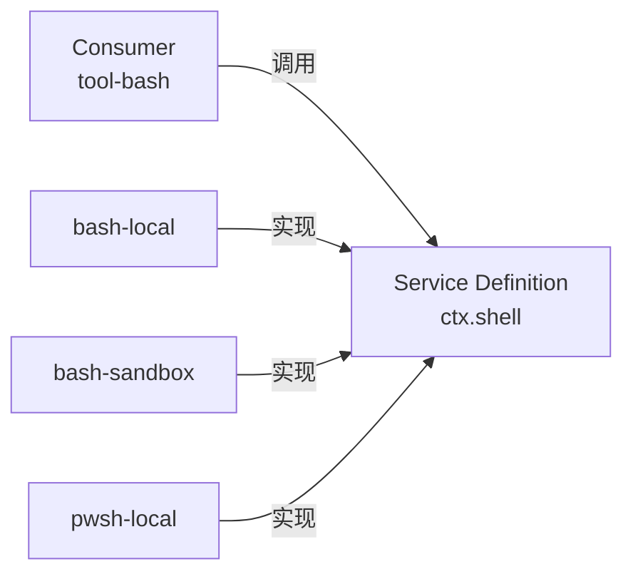
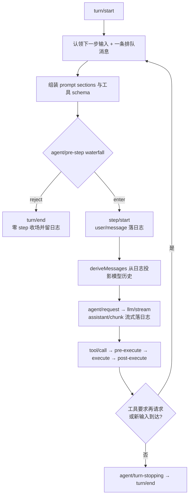

# 02 · 架构与代码结构梳理

> 个人学习笔记；权威底本是 [architecture.md](../architecture.md)。配图见同目录 [architecture-diagram.html](architecture-diagram.html)。

## 全景分层

自底向上五层：vendored 框架 → 组装层 → Cordis 插件树（spine + seams + providers）→ 数据面 → 应用入口。

## Cordis：五个要点

Cordis 是被 vendor 进仓库的插件框架，理解它才能读懂任何包。浓缩版（完整版见 [cordis-primer.md](../cordis-primer.md)）：

1. **插件即 Service**：要么是一个带 `inject` / `apply(ctx)` 字段的函数，要么是 `Service` 子类，由框架挂载进当前 context。
2. **context 是服务仓库**：一个服务声明稳定的 `ctx.<key>`（如 `ctx.tools`、`ctx.llm`），其他插件按 key 找服务而不是 import 具体实现。
3. **`inject` 声明依赖**：依赖未就绪的插件自动等待，加载顺序由服务需求表达，不需要手工排序。
4. **类型化事件通信**：事件名通过 TypeScript declaration merging 声明，按 `emit` / `waterfall` / `parallel` / `serial` 四种模式派发。
5. **注册即可逆 effect**：prompt section、工具 schema、适配器、监听器都经 `ctx.effect()` / `ctx.on()` 安装，插件卸载时自动回卷。

四种派发模式的差别：

| 模式 | 是否等待 | 顺序 | 有返回值 |
|---|---|---|---|
| `emit` | 否 | 注册顺序观察 | 无 |
| `waterfall` | 否 | 注册顺序观察 | 有 |
| `parallel` | 是 | 并行观察 | 无 |
| `serial` | 是 | 注册顺序 | 有 |

**waterfall 是 around 中间件**：监听器收到 `(...args, next)`，必须调用 `next()` 把结果委托给下一个监听器；不调用即短路拦截。策略类监听器短路是设计意图，纯观察类监听器漏调 `next()` 则是 bug——这是本仓库最强调的约定之一。

## 启动组装：profile 与 bundle

一次 `dsh` 启动 = 从空插件列表开始按序叠层：

1. profile 清单里列出的每个 bundle 的补丁（如 `dsh-base` → `dsh-web-app`）；
2. profile 自己的 `cordis.patch.yml`；
3. home 级 `$DSH_HOME/cordis.patch.yml`；
4. 命令行 `--patch` 覆盖层。

bundle 是「Cordis 配置行 + 其挂载代码」的分发格式；patch 按 id 定位某一行，整体替换其配置或插入新行。所以任何一层都能改写下层的东西——这就是「没有特权核心」的落地方式。用 `dsh --profile web --dump-config` 可以打印你机器上真实组装出的树。

## Core spine：产品 API 主干

`packages/core/` 七个包构成默认控制主干（表见 [core/README](../../packages/core/README.md)）：

| 包 | 职责 | ctx key |
|---|---|---|
| `scope` | 把注册圈定在单个 agent 内的原语 | 库，无 key |
| `session` | append-only 会话日志 + 内存 store | `ctx.sessions` |
| `system-prompt` | prompt section 与工具 schema 组装 | `ctx.systemPrompt` |
| `tools` | 工具注册表 + 带守卫的执行管线 | `ctx.tools` |
| `agent` | Agent 接口、live registry、`agent/*` 事件 | `ctx.agents` |
| `agent-default-model` | 部署级默认模型选择 | `ctx.agentDefaultModel` |
| `agent-loop` | 默认 loop 驱动（唯一具体实现） | `ctx.agentLoop` |

注意依赖方向：扩展插件依赖 `dsh-agent` 接口而非 `dsh-agent-loop` 实现，loop 本身也是可替换的。

## Capability seam：三角色换件

**seam = 一个可替换能力位**，由三个角色构成：Service Definition（声明接口）、Service Provider（实现）、Consumer（使用方，常是模型工具）。只有其中一个角色不算 seam。全部 seam 的关系图是生成物 [capability-seams.md](../capability-seams.md)。

seam 的价值在「换一个 provider，整个产品跟着变」：`fs` 和 `subprocess` 的 provider 共享同一个执行世界，把两者一起指向 E2B 远程沙箱，bash、PTY、LSP 就整体搬进了云端，不需要任何 provider 分叉。subagent 同理，六种 transport 藏在一个接口后面。

## 事件三域：新行为挂在哪

选对事件域是大多数改动的前置决策：

- **Session events**：持久事实，追加进日志并经 `session/event` 广播；需要跨重启存活的事实用它。
- **Agent events**（`agent/*`）：携带 live Agent（inbox、step、status、request…），用于观察或拦截进行中的工作。
- **Capability events**（`fs/*`、`tools/*`、`telemetry/*`）：给某个 seam 挂策略或适配器，不接触 loop。

完整的生产者/消费者对照在 [event-producer-consumer.md](../event-producer-consumer.md)。

## Turn 与 Step：循环怎么转

术语：**step** = 一次模型请求 + 它触发的工具调用；**turn** = 零或多个 step，从认领第一份输入开始，到没有任何欠账为止。

要点：`agent/pre-step` 决定模型看到什么（可改写可拒绝）；四个 waterfall（`agent/pre-step`、`agent/request`、`llm/stream`、三个 `tools/*`）的监听器必须 `next()`；输入经唯一 inbox 进入，注入的上下文要等下一条真消息才被唤醒。逐步时序图见 [agent-lifecycle.md](../agent-lifecycle.md)，工具管线细节见 [tool-execution-pipeline.md](../tool-execution-pipeline.md)。

## Session log：唯一事实源

会话日志既是 UI 回放的素材，也是模型上下文的来源：`deriveMessages()` 从日志投影出模型历史，fork / resume / transcript / telemetry 全部从这条流派生。「model-visible ⟺ logged」由运行时不变量断言——想给模型看新东西，就必须先有新的 session event 类型（扩展 `SessionEventMap`）。原始 `assistant/chunk` 也保留在日志里以保住回放保真度。

## 包组目录地图

`packages/` 下约五十个组，按职责归类（权威表格见 [packages/README.md](../../packages/README.md)）：

| 归类 | 组 |
|---|---|
| 产品主干 | `core/`、`api/`（BFF + Typert RPC 网关）、`typert/`（类型图生成与运行时注册表） |
| LLM | `llm/`（抽象 service + deepseek / pi-ai / replay 适配器） |
| 执行世界 | `shell/`、`terminal/`、`subprocess/`、`code-runtime/`、`sandbox/`、`e2b/` |
| 文件与智能 | `fs/`、`lsp/`、`skill/`、`web/`、`mcp/` |
| 编排 | `subagent/`、`workflow/`、`jobs/`、`goal/`、`schedule/`、`preset/` |
| 会话数据面 | `session/`、`session-query/`、`compaction/`、`attachment/`、`spill/`、`storage/`、`workspace/` |
| 人机协作 | `interaction/`（approval / permission / commands / ask-user）、`plan/`、`todo/`、`feedback/`、`guard/` |
| 上下文 | `context/`（workspace 说明、时间等模型可见上下文） |
| 自我修改与桥接 | `extensions/`、`hooks/` |
| 配置与身份 | `settings/`、`credentials/`、`identity/` |
| Web GUI 两半 | `host/`（API 网关 + HTTP 路由）、`client/`（约四十个 `ui-*` 浏览器插件） |
| 运行载体 | `boot/`、`bundle/`（base / web-app / headless）、`sdk/`、`acp/` |
| 支撑 | `examples/`、`test-support/`、`util/`、`experimental/` |

仓库其余顶层目录：`apps/cli`（dsh 启动器）、`apps/web`（前端源码）、`vendor/`（Cordis 快照）、`python/`（Python SDK）、`native/`（Landlock addon）、`examples/`（可运行的 cordis.yml 叶子）、`scripts/`（门禁与生成器）、`website/`（文档站投影）、`.agents/`（工作流与决策笔记）。

## 质量门禁速览

这个仓库把大量约定做成了可执行门禁（`pnpm run doc-sync`、`hygiene`、`check:windows-wine` 等，聚合器在 [run-gates.ts](../../scripts/run-gates.ts)）：逐文件 100% 覆盖率、keyless 快照回放、生成目录新鲜度、双语配对、Markdown 单段单行、链接与 mermaid 可渲染性、导出 JSDoc 完整性……读代码时看到「为什么会有这么个脚本」，答案通常是某条 CLAUDE.md 约定的机械化执行。

## 延伸阅读

- [extension-cookbook](../cookbook/extension-cookbook.md)：想加功能时，先查这张「目标 → 机制」对照表。
- [defensive-patterns.md](../defensive-patterns.md)：生命周期、并发、子进程、拆除工作的防御模式。
- [glossary.md](../glossary.md)：术语表（seam、profile、bundle、step、turn…）。
